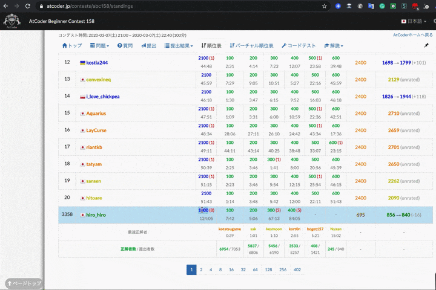

# AtCoder-Jump-to-Submissions-from-Standings

Jump to personal submissions from standings score in AtCoder.

## Description

This user script was inspired by [Codeforces](https://codeforces.com/) standings page and [the tweet](https://twitter.com/jupijupi111/status/1220548897233231873).

***DEMO***



## Features

- Show personal AC codes when the standings score was double-clicked.
  - Standings type
    - Standings
    - Virtual Standings
    - Standings (Mult)
    - Team Standings
      - Note: Show only individual participation.
  - Relationships between scores and submissions
    - Total Score    : All of the contestant.
    - Task A, B, ... : Task A, B, ... only.

## Getting started

1. Install userscirpt manager ([Tampermonkey](https://www.tampermonkey.net/)) in your browser.
2. Install [Me](https://greasyfork.org/ja/scripts/397528-atcoder-jump-to-submissions-from-standings).
3. Click Tampermokey icon, turn on the userscript "Enabled" in dashboard.

### Usage

1. Select a standings page in AtCoder.
2. Double click on the contestant's score you want to watch submissions.
3. You can view the contestant's submissions. Enjoy!

## How to clone the repository

Paste the following commands at a Terminal prompt.

```terminal
$ mkdir hoge
$ cd hoge
$ git clone git@github.com:KATO-Hiro/AtCoder-Jump-to-Submissions-from-Standings.git
```

## Links

[AtCoder](https://atcoder.jp/)

[Original tweet](https://twitter.com/jupijupi111/status/1220548897233231873)

[User script guide](https://simply-how.com/enhance-and-fine-tune-any-web-page-the-complete-user-scripts-guide)

[User script for beginner](https://qiita.com/i_completely_understand/items/acf3e5efe0db848989d9)

[Readme Driven Development; RDD](https://qiita.com/b4b4r07/items/c80d53db9a0fd59086ec)

## Author

[@KATO-Hiro](https://twitter.com/k_hiro1818)

## License

[CC0](https://creativecommons.org/share-your-work/public-domain/cc0)
